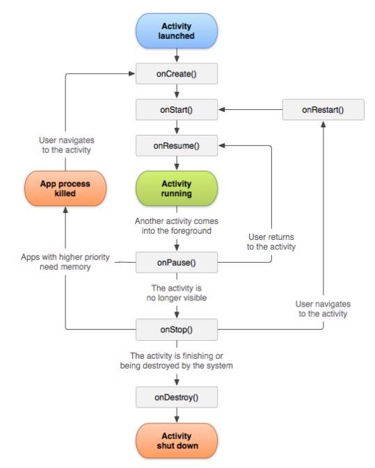
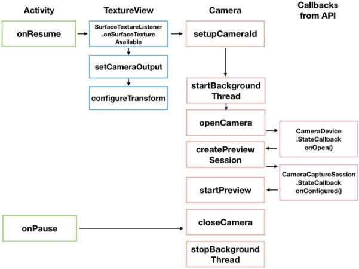
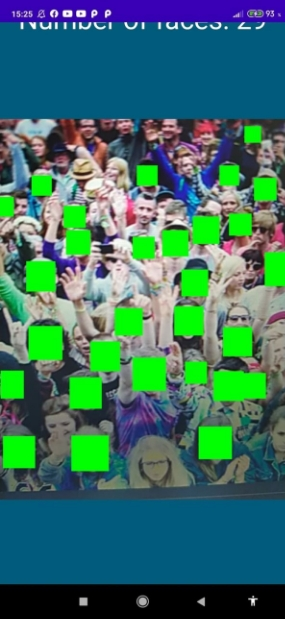
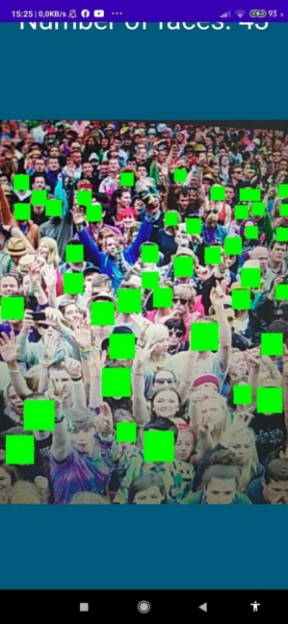
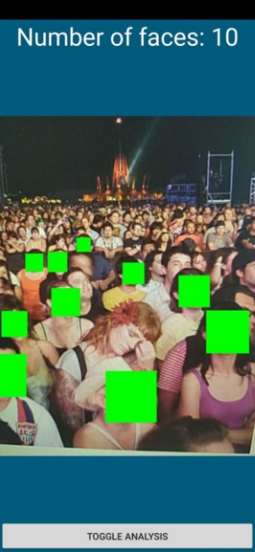

***„Szacowanie ilości osób w tłumie na platformie Android”*** 
Łukasz Olejnik, Patryk Sulej

1. **Przegląd rozwiązań** 

W celu osiągnięcia postawionego celu detekcji i zliczania ludzi w tłumie dokonaliśmy przeglądu możliwych rozwiązań. Pierwszym z nich był ML Kit, który został nam polecony. Niestety po krótkiej analizie okazało się, że androidowy Machine Learning kit w istocie jest bardzo szybkim rozwiązaniem, ale też bardzo ograniczonym. Pozwala on na klasyfikację obiektów  za  pomocą  zintegrowanej  sieci  neuronowej,  odczytywanie  barcodów, rozpoznawanie tekstu, czy detekcję twarzy, gdzie dla nas to ostatnie było jedyną kwalifikującą się opcją. Byliśmy jednak świadomi dużej niedoskonałości tego rozwiązania – tłum musiałby być odwrócony twarzą do nas i musielibyśmy mieć twarze w na tyle dużej rozdzielczości, aby algorytm był w stanie je wykryć. Następną możliwością była biblioteka OpenCV jednak i tutaj wykrywanie  ludzi  w  tłumie  byłoby  niezwykle  trudne.  Raczej  za  pomocą  współczynników kształtu byłoby to niewykonalne, gdyż w tłumie zliczalibyśmy głowy, a współczynnik kształtu głowy mógłby być bardzo różny w zależności od perspektywy. Jedyną możliwością tutaj byłoby  zliczanie  poruszających  się  blobów  po  odpowiednich  przekształceniach morfologicznych, przy założeniu, że użytkownik nie poruszałby telefonem i poruszaliby się tylko ludzie. Moglibyśmi zliczać bloby opuszczające ekran. Takie rozwiązanie również nas nie zadawalało ze względu na dużą niedoskonałość. Zdecydowaliśmy się więc na wykorzystanie sieci neuronowej, która wykrywałaby na zdjęciach głowy. Jest to świetne narzędzie do tego zadania,  gdyż  pozwala na  nauczenie  sieci  jakie  elementy ma  wykrywać,  a  poprawność działania w przypadku różnych perspektyw może być zwiększana poprzez powiększanie zbioru uczącego. Ta część sprawiła nam jednak najwięcej trudności i została opisana w punkcie 3. Jeśli chodzi o wyświetlanie obrazu na telefonie to nie mieliśmy zbyt dużego wyboru, chcąc zrealizować projekt w duchu programowania niskopoziomowego. Mieliśmy do wyboru starsze API Camera oraz nowsze API Camera2 i zdecydowaliśmy się użyć nowszego, co jak się później okazało nie było do końca najlepszym pomysłem. 

2. **Wyświetlanie obrazu z kamery na ekranie.** 

Do obsługi kamery w naszym projekcie wybraliśmy API Camera2. Pobranie obrazu z kamery i wyświetlenie go na ekranie jest procesem wieloetapowym. Wiąże się z obsługą odpowiednich wywołań zwrotnych (ang. *callbacks*) i metod systemu Android związanych z cyklem życia Aktywności (ang. *Activities*). Ponieważ cały proces jest dość skomplikowany to postaram się najpierw przedstawić ogólny przebieg programu, a następnie opisać metody 

pomocnicze.



*Rysunek 1. Cykl życia Activity. Źródło: https://developer.android.com/guide/components/activities/activity- lifecycle.* 



*Rysunek 2. Schemat działania Camera2 API. Źródło https://proandroiddev.com/understanding-camera2-api-from- callbacks-part-1-5d348de65950* 
```

Zmienne zdefiniowane na poziomie Aktywności: **val MAX\_PREVIEW\_WIDTH** = 640 

**val MAX\_PREVIEW\_HEIGHT** = 460 

**lateinit var myCameraId**:String 

**var myCaptureSession**:CameraCaptureSession? = **null** 

**var myCameraDevice**:CameraDevice? = **null** 

**var myBackgroundThread**:HandlerThread? = **null** 

**var myBackgroundHandler**: Handler? = **null** 

**var myImageReader**:ImageReader? = **null** 

**lateinit var myPreviewRequestBuilder**: CaptureRequest.Builder **lateinit var myPreviewRequest**: CaptureRequest 

**var myCameraOpenCloseLock**: Semaphore = Semaphore(1) **val REQUEST\_CAMERA\_PERMISSION** = 1 

MAX\_PREVIEW\_WIDTH, MAX\_PREVIEW\_HEIGHT - zmienne oznaczające wymaganą rozdzielczość obrazu z kamery, w naszym projekcie eksperymentowaliśmy z różnymi sieciami neuronowymi (różne sieci wymagają obrazów o różnej rozdzielczości na wejściu) oraz różnymi metodami wyświetlania obrazu na ekranie, obecnie te zmienne mają nieco szersze znaczenie niż tylko rozdzielczość podglądu, 

myBackgroundThread - wątek obsługujący kamerę, 

myBackgroundHandler - uchwyt do wątka obsługującego kamerę, myCameraOpenCloseLock - wskaźnik służący do sygnalizacji stanu włączonej kamery, z kamery może korzystać w danej chwili tylko jeden wątek REQUEST\_CAMERA\_PERMISSION - kod identyfikacyjny zapytania o uprawnienia do korzystania z kamery, jego wartość nie ma wielkiego znaczenia, ważne by była stała. 
```
Pozostałe zmienne zostaną omówione w trakcie omawiania kodu. Cały proces rozpoczyna się w metodzie onResume().  
```
**override fun** onResume() { 

   `**super**.onResume() 

   `startBackgroungThread() 

  `openCamera(**MAX\_PREVIEW\_WIDTH**,**MAX\_PREVIEW\_HEIGHT**) } 
```
Wywołanie metody onResume jest równoznaczne z rozpoczęciem użytkowania programu przez użytkownika np. po odblokowaniu telefonu. Praca kamery musi być obsługiwane przez inny wątek niż pozostała część aplikacji (dla zwiększenia responsywności). Jest on tworzony w  metodzie  startBackgroundThread().  Metoda  openCamera()  służy  do  konfiguracji  i nawiązania łączności z kamerą.  
```

**private fun** openCamera(width: Int,height: Int){ 

      `**if** (ContextCompat.checkSelfPermission(**this**, Manifest.permission.*CAMERA*) != PackageManager.*PERMISSION\_GRANTED*){ 

           `requestCameraPermission() 

           `**return** 
**
       `} 

       `setUpCameraOutputs(width, height)* 
\*
       `**var** cameraManager = getSystemService(Context.*CAMERA\_SERVICE*) **as** CameraManager 

       `**try**{ 

           `**if** (!**myCameraOpenCloseLock**.tryAcquire(2500, TimeUnit.**MILLISECONDS**)){ 

               `**throw** RuntimeException(**"Time out waiting to lock camera opening"**) 

           `} 

           `cameraManager.openCamera(**myCameraId**,**cameraCDSC**,**myBackgroundHandler**)        }**catch** (e: CameraAccessException){ 

          `e.printStackTrace() 

      `}**catch** (e:InterruptedException){ 

           `**throw** RuntimeException(**"Interrupted while trying to lock camera opening"**) 

       `} 

   `} 
```
**Ostateczne rozwiązanie w postaci ImageView, ML Kit oraz Firebase** 

Ostatecznie zdecydowaliśmy się na to, aby wyświetlać obraz na warstwie ImageView po pobraniu  zdjęcia  z  ImageReadera  za  pomocą  OnImageAvailableListenera  w  metodzie onImageAvailable: 
```
val readImage: Image? = reader?.acquireLatestImage() 

val bBuffer: ByteBuffer = readImage?.getPlanes()?.get(0)!!.getBuffer() bBuffer.rewind() 

val buffer = ByteArray(bBuffer.remaining()) 

readImage?.getPlanes().get(0).getBuffer().get(buffer) 

val bitmap = BitmapFactory.decodeByteArray(buffer, 0, buffer.size) val matrix = Matrix() 

matrix.postRotate(90F) 

var rotatedBitmap = Bitmap.createBitmap(     bitmap, 

`    `0, 

`    `0, 

`    `bitmap.*width*, 

`    `bitmap.*height*, 

`    `matrix, 

`    `true 

) 
```
Obraz konwertowany jest do bitmapy, poddawany rotacji,  a następnie konwertowany do formatu  FirebaseVisionImage  i  przekazywany  do  detektora  i  wyświetlany  poprzez setImageBitmap: 
```
val image: FirebaseVisionImage = FirebaseVisionImage.fromBitmap(rotatedBitmap) val detector: FirebaseVisionFaceDetector = FirebaseVision.getInstance() 

`    `.getVisionFaceDetector(options) 

val result: Task<List<FirebaseVisionFace>> = detector.detectInImage(image) 

`    `.addOnSuccessListener( 

`        `object : OnSuccessListener<List<FirebaseVisionFace?>?> { 

`            `override fun onSuccess(faces: List<FirebaseVisionFace?>?) { 

`                `// Task completed successfully 

`                `// ... 

`                `numberOfFaces.setText("Number of faces: ${faces!!.*count*()}")             for (face in faces!!) { 

`                `val bounds = face?.*boundingBox* 
\*
`                `var p: Paint = Paint(Paint.*ANTI\_ALIAS\_FLAG*) 

`                `var canvas: Canvas = Canvas(rotatedBitmap) 

`                `p.setColor(Color.rgb(0, 255, 0)) 

`                `p.setTextSize(10F) 

`                `var rect: Rect = Rect(bounds) 

canvas.drawRect(rect, p) 

`            `} 

`                `myImageView.setImageBitmap(rotatedBitmap) 

… 
```
Operacja wyświetlania obrazu musi być wykonywana na tym samym wątku, co operacja UI. 

Do wykrywania twarzy wykorzystaliśmy ML Kit, który wymagał połączenia aplikacji z Firebase. Firebase pozwala na gromadzenie danych w chmurze, analizowanie aplikacji na przeróżne sposoby oraz na dostęp do wielu innych opcji w bardzo prosty, lecz ograniczony sposób. W naszym przypadku było to potrzebne do wykorzystania ML Kit. 


*Rysunek 9. Kilka dostępnych opcji pakietu Firebase. W tym ML Kit.* 

Ostatecznie  aplikacja  działa  w  ten  sposób,  że  obraz  do  analizy  zostaje  wyświetlony  po wciśnięciu przycisku „Toggle analysis” bez dostępnego podglądu. (powodował on przeskoki w czasie „wolnym” od analizy, wynikające z tego, że w momencie zablokowania odświeżania obrazu  na  ImageView(w  tym  czasie  wyświetlana  była  klatka,  która  miała  zostać przeanalizowana i na niej zaznaczone twarze i obliczona ich ilość), ImageReader wciąż przyjmował nowe obrazy, a po wyłączeniu zablokowania jeszcze przez kilkanaście sekund podawał do ImageView obrazy przyjęte w czasie zablokowania i podawał je do analizy(nie mamy zupełnie pojęcia jakim cudem i dlaczego tak się działo) przez co zamiast czystego podglądu było naprzemienne migotanie. 

Udało nam się uzyskać następujące efekty: 



*Rysunek 10. Szacowana ilośc osób: 29.* 



*Rysunek 11. Szacowana ilość osób: 43.* 



*Rysunek 12. Finalny efekt działania aplikacji.* 

5. **Podsumowanie oraz wnioski** 

Jako dowód naszych zmagań załączam link do folderu Google Drive. Są tam różne bardziej lub na ogół mniej udane modele, notatniki z Google Colab i zdjęcia których używaliśmy do uczenia. [https://drive.google.com/drive/folders/1DLvxXKHNHT-Vjty1ZjVBjhiCKmTrMtbV?usp=sharing ](https://drive.google.com/drive/folders/1DLvxXKHNHT-Vjty1ZjVBjhiCKmTrMtbV?usp=sharing)

Kod programu oraz plik instalacyjny CrowdCounter.apk znajduje się w zdalnym repozytorium:[ https://github.com/Patric/CrowdCounter ](https://github.com/Patric/CrowdCounter) 

Najważniejsze źródła z jakich korzystaliśmy w projekcie: 

1. [https://github.com/googlearchive/android- Camera2Basic?fbclid=IwAR3jzjhUpxpvNFY0p5YlTcRV7GbgiVrW5fhaRFFescqApsx- HJSibBuo-Dw ](https://github.com/googlearchive/android-Camera2Basic?fbclid=IwAR3jzjhUpxpvNFY0p5YlTcRV7GbgiVrW5fhaRFFescqApsx-HJSibBuo-Dw)
1. [https://www.programming-books.io/essential/android/preview-the-main-camera-in-a- textureview- 11d1affae06744e3943e8f788abf3090?fbclid=IwAR1oJBHpBf_Ggxa_UDqeJ9nsZUIw QLJWV_HYkxi-8Ag_nfYXUHV40sKF5p4 ](https://l.facebook.com/l.php?u=https%3A%2F%2Fwww.programming-books.io%2Fessential%2Fandroid%2Fpreview-the-main-camera-in-a-textureview-11d1affae06744e3943e8f788abf3090%3Ffbclid%3DIwAR00t4U1LN5oadOibylyT3ZftDb4AJpv0QG554ZPODzxd2jpyEw546lYWmg&h=AT1WkXi5HRRWqiOcz8PskkD5qLZZ_KNDIn5v3VG6D17b1fT5Bifb89KZa0CBKCmpelYzlvZCQt4-RqurQNDNRLwhqhL2jj1t5wCyzlN9aUvXWYGkO6RzApt4icHzTyq3ZOgQiQ)
1. [https://proandroiddev.com/understanding-camera2-api-from-callbacks-part-1- 5d348de65950 ](https://l.facebook.com/l.php?u=https%3A%2F%2Fproandroiddev.com%2Funderstanding-camera2-api-from-callbacks-part-1-5d348de65950%3Ffbclid%3DIwAR2Yi17su_6E0DU5XmPva_SWhgdZic_33DabqGug6IXQY8hxis94hY8c69w&h=AT1WkXi5HRRWqiOcz8PskkD5qLZZ_KNDIn5v3VG6D17b1fT5Bifb89KZa0CBKCmpelYzlvZCQt4-RqurQNDNRLwhqhL2jj1t5wCyzlN9aUvXWYGkO6RzApt4icHzTyq3ZOgQiQ)
